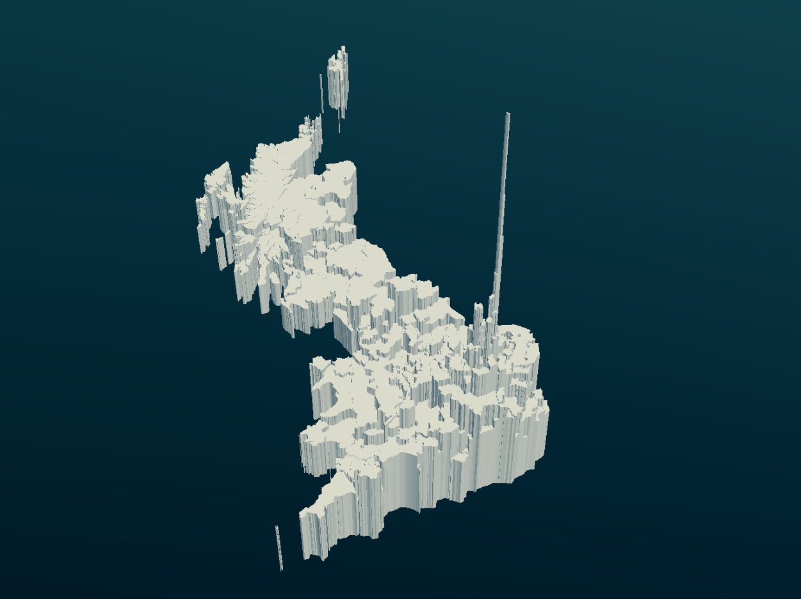

# UK house prices 3D visualisation

## About
3D data visualisation task at the UK Data Service Open Data Hackathon, 24th September 2016

- [View stl full size](https://github.com/philmikejones/datavis3d/blob/master/stl/house_prices.stl)
- [Download the stl file](stl/house_prices.stl)

## Instructions

1. Fork, clone, or download the repository.
2. Run the scripts in `data-raw/` in order using R

## Data and boundary sources

* Shapefiles obtained from [UKDS boundary data easy download service](census.ukdataservice.ac.uk/easydownload)
* House prices obtained from 
[Land Registry public data](http://publicdata.landregistry.gov.uk/market-trend-data/house-price-index-data/Average-prices-2016-07.csv)
